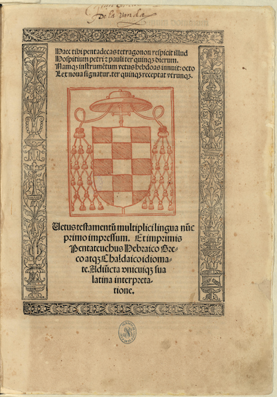

# *Biblia complutensis nova*: a digital polyglot Bible

## Digital texts

This repository includes citable versions of openly licensed Hebrew, Latin, Greek and Aramaic texts.

The file `corpus/compnov.cex` is a single file in CEX format with all of the included digital texts.

## Sources for the texts

### Tanach, Vulgate, Septuagint

The texts of the Hebrew Bible, the Latin translation of Jerome and the Greek translation of the Septuagint are from ebibles.org.

Plain-text versions of the openly licensed Bibles from ebibles.org are in the `src` directly. See `src/sources.cex` for metadata about the versions included here. 

The file `scripts/citify.jl` is a Julia script for converting the ebibles source texts (in the `src` directory) to a single citable corpus (included in `corpus/compnov.cex`).

### The Targum Onkelos

The digital text of the Targum Onkelos is taken from the "merged" texts in this directory of the Sefaria project's data: 
https://github.com/Sefaria/Sefaria-Export/tree/master/txt/Tanakh/Targum/Onkelos/Torah

The text contents of the Sefaria files in in the directory `src/onkelos`. The file `src/onkelos/source-credits.txt` has the Sefaria project's metadata about each text.

The script `src/onkelos/parse-onkelos.jl` is a Julia script that creates a single file in CEX format from the five source files.

## Other content

- `pluto`: Pluto notebooks, including 
    - a notebook for browsing the texts by canonical reference (`browser.jl`)
    - a notebook for searching the text of the Hebrew Bible (`stringsearch.jl`)

## The original Complutensis

- The National Library of Spain has made images of its copy of the Complutensis available.

